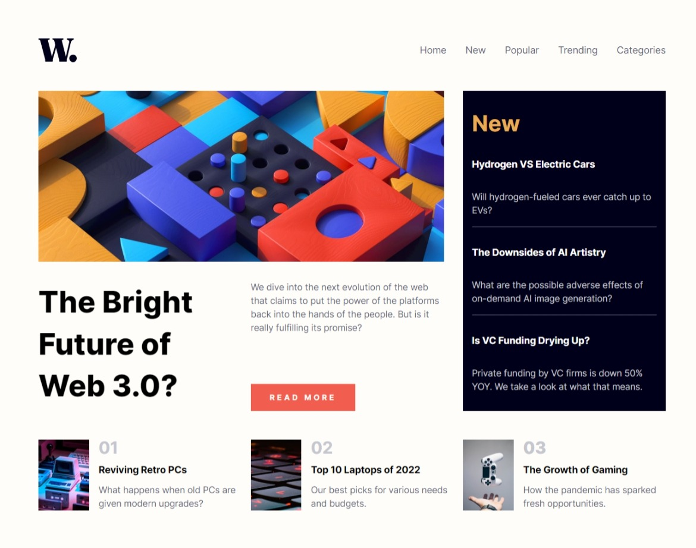
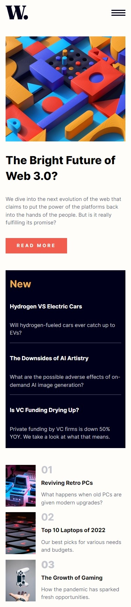

# Frontend Mentor - News homepage solution

This is a solution to the [News homepage challenge on Frontend Mentor](https://www.frontendmentor.io/challenges/news-homepage-H6SWTa1MFl). Frontend Mentor challenges help you improve your coding skills by building realistic projects.

## Table of contents

- [Overview](#overview)
  - [The challenge](#the-challenge)
  - [Screenshot](#screenshot)
- [My process](#my-process)
  - [Built with](#built-with)
  - [What I learned](#what-i-learned)
- [Author](#author)

## Overview

### The challenge

Users should be able to:

- View the optimal layout for the interface depending on their device's screen size
- See hover and focus states for all interactive elements on the page

### Screenshot

### Links

- Repository URL: [https://github.com/ExiviuZ/news-homepage-main]
- Live Site URL: [https://exiviuz.github.io/news-homepage-main]

## My process

### Built with

- Semantic HTML5 markup
- SCSS custom properties
- Flexbox
- CSS Grid
- Desktop-first workflow

### What I learned

I learned a lot about how to create a responsive grid layout with the use of auto-fit keyword with the combination of minmax function in order to wrap the elements base on the sizes automatically creating a responsive design with the least amount of effort.

## Author

- Frontend Mentor - [@yourusername](https://www.frontendmentor.io/profile/exiviuz)
